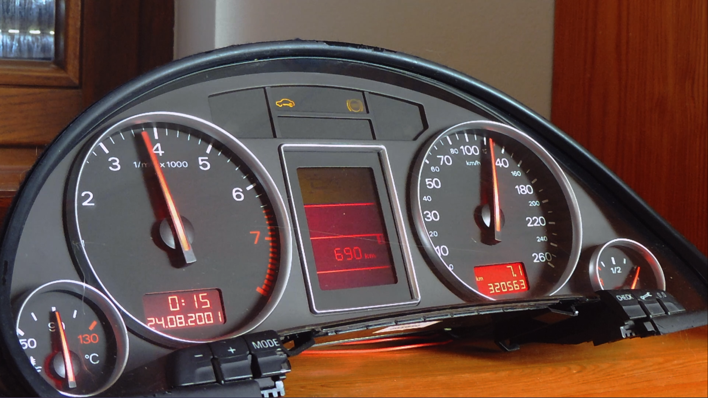
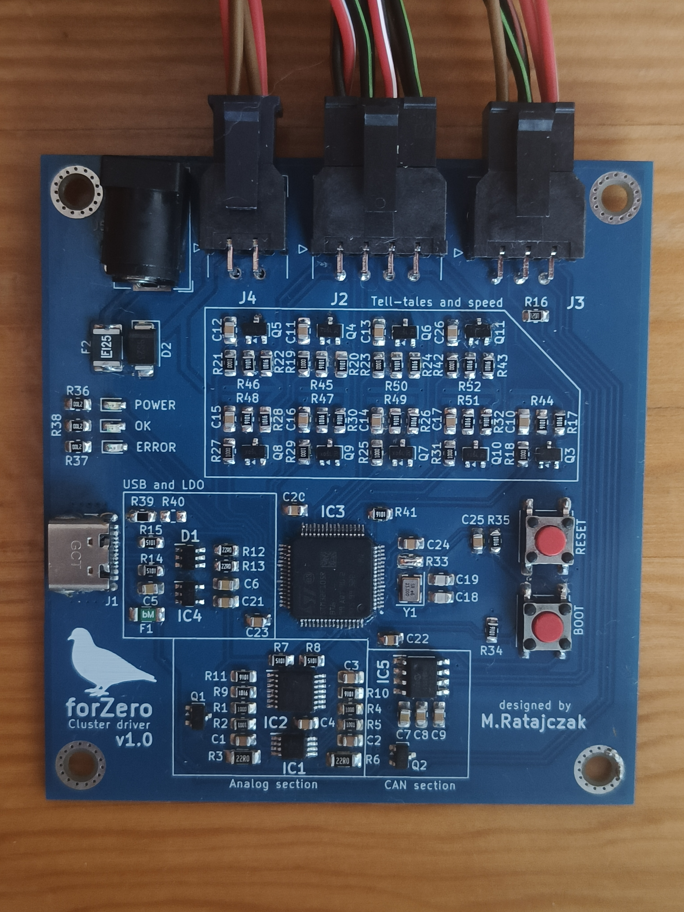
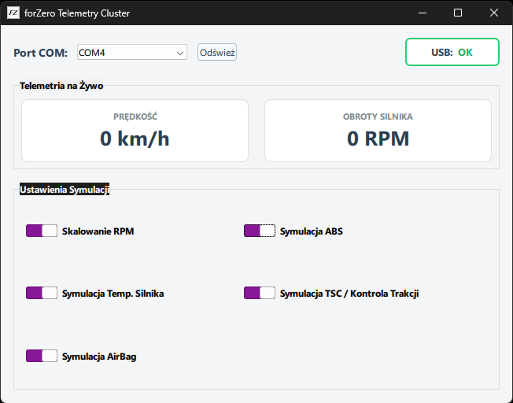

# ForZero

Sterownik fizycznego zestawu wskaźników Audi A4 B6, pozwalający wyświetlać telemetrię z Forza Horizon 6 przy użyciu STM32, CAN, USB i autorskiej aplikacji Qt.

ForZero powstał jako próba wykorzystania fizycznego zestawu wskaźników jako elementu stanowiska simracingowego. Projekt obejmuje rozpoznanie sposobów sterowania licznikiem, zaprojektowanie i uruchomienie własnej PCB, firmware mikrokontrolera oraz aplikację komputerową.

## Demo

<!-- Do uzupełnienia: wstaw link do opublikowanego filmu, np. [Zobacz demonstrację na YouTube](URL). -->

Film przedstawiający projekt: link zostanie dodany po publikacji.

## Możliwości

- Wyświetlanie prędkości i obrotów silnika na fizycznym liczniku.
- Sterowanie wskazaniami poziomu paliwa i temperatury płynu chłodzącego.
- Obsługa wybranych kontrolek i komunikatów ostrzegawczych.
- Przybliżona symulacja stanów ABS, TCS i AIRBAG oraz temperatury płynu chłodzącego na podstawie dostępnej telemetrii.
- Odbiór danych UDP z gry i przesyłanie przetworzonych wartości do sterownika przez USB VCP.
- Pomiar opóźnień komunikacji na podstawie potwierdzeń wykonania ramek.
- Zerowanie prędkości i obrotów po 500 ms bez poprawnej ramki danych.

Gra nie udostępnia bezpośrednio wszystkich odwzorowywanych stanów. Algorytmy symulacji kontrolek i temperatury służą do przybliżonego odtworzenia ich zachowania; nie są modelami fizycznymi układów pojazdu.

## Jak to działa

Gra wysyła telemetrię przez UDP. Aplikacja Qt odbiera i parsuje pakiety, wykonuje dodatkową logikę oraz przesyła dane przez USB VCP do STM32F105. Mikrokontroler generuje sygnały elektryczne wymagane przez zestaw wskaźników.

Badany licznik wykorzystuje kilka różnych sposobów sterowania:

| Funkcja | Sposób sterowania |
| --- | --- |
| Obrotomierz | Ramki CAN |
| Prędkościomierz | Sygnał impulsowy o regulowanej częstotliwości |
| Poziom paliwa i temperatura | Emulacja rezystancji czujników |
| Wybrane kontrolki i ostrzeżenia | Sygnały logiczne 12 V |

Wskazania paliwa i temperatury skalibrowano eksperymentalnie. Zmierzone charakterystyki opracowano z wykorzystaniem interpolacji PCHIP w MATLAB-ie.

## Sprzęt

- Autorska dwuwarstwowa PCB zaprojektowana w KiCad.
- Mikrokontroler STM32F105 z jednoczesną obsługą USB i CAN.
- Transceiver CAN MCP2562 z osobnym zasilaniem interfejsu logicznego.
- Układy emulacji rezystancji oparte na potencjometrze cyfrowym MCP4661, wzmacniaczach operacyjnych i tranzystorach MOSFET.
- Tranzystorowe stopnie sterujące wejściami 12 V licznika.
- Złącze USB-C, zewnętrzne zasilanie 12 V i złącza Molex Micro-Fit 3.0.
- Zabezpieczenie ESD linii USB oraz bezpieczniki polimerowe na liniach zasilania.

## Oprogramowanie

### Aplikacja PC — C++ / Qt

Aplikacja ma trzy wątki: GUI, odbiór UDP oraz komunikację USB. Oddzielenie komunikacji od interfejsu użytkownika pozwala odbierać telemetrię i obsługiwać sterownik bez wykonywania tych operacji w wątku GUI.

Aplikacja odpowiada za parsowanie telemetrii, symulację wybranych wskazań, przygotowanie ramek dla sterownika i wyznaczanie statystyk opóźnień.

### Firmware — C / STM32 HAL

Firmware powstał w STM32CubeIDE z wykorzystaniem bibliotek HAL. Zadania w pętli głównej są wyzwalane zdarzeniowo lub w ustalonych interwałach:

| Sygnał | Aktualizacja |
| --- | --- |
| Prędkość i kontrolki | Po otrzymaniu nowych danych, gdy wartość się zmieni |
| Obroty silnika | Ramka CAN co 20 ms |
| Temperatura | Co 2 s |
| Poziom paliwa | Co 5 s, jeżeli odebrano nowe dane |

Własny protokół przesyłany przez USB VCP wykorzystuje znaczniki ramki, CRC8, numer sekwencyjny i potwierdzenie wykonania `Exec Ack`. Parser posiada timeout odbioru, a brak poprawnych danych przez 500 ms powoduje wyzerowanie prędkości i obrotów.

## Opóźnienia

Aplikacja mierzy czas przejścia danych w pętli PC–sterownik–PC (RTT), wykorzystując numery ramek i odpowiadające im potwierdzenia. Statystyki obejmują ostatnie 20 000 pomiarów.

W zestawach pomiarowych opisanych w dokumentacji średnie RTT zazwyczaj wynosiło poniżej 1 ms, a P99 poniżej 4 ms. W najbardziej skrajnym zarejestrowanym zestawie P99 osiągnął 17 ms. Są to wyniki przeprowadzonych testów, a nie gwarantowane limity czasowe.

**RTT nie jest pomiarem czasu od zdarzenia w grze do mechanicznego wychylenia wskazówki.** Poszczególne wyjścia mają własne okresy odświeżania, a licznik dodatkowo filtruje wskazania. Projekt pracuje jako system soft real-time.

## Zawartość repozytorium

| Folder | Zawartość |
| --- | --- |
| [Aplikacja Qt](Aplikacja%20Qt/) | Kod źródłowy aplikacji komputerowej |
| [Oprogramowanie sterownika](Oprogramowanie%20sterownika/) | Projekt firmware mikrokontrolera STM32 |
| [Schematy](Schematy/) | Materiały dotyczące części sprzętowej |
| [Obrazy](Obrazy/) | Zdjęcia i grafiki wykorzystywane w README |

## Uruchomienie

### Wymagania

- Zestaw wskaźników zgodny z egzemplarzem wykorzystanym w projekcie.
- Zmontowany sterownik ForZero, przewody połączeniowe i zasilanie 12 V.
- Przewód USB obsługujący transmisję danych.
- Komputer z aplikacją ForZero oraz Forza Horizon 6.
- Do samodzielnego zbudowania oprogramowania: środowisko Qt z kompilatorem C++ oraz STM32CubeIDE.

### Kolejność czynności

1. Przy odłączonym zasilaniu połącz sterownik z licznikiem zgodnie ze schematem połączeń w dokumentacji. Uwzględnij numerację pinów obu złączy licznika.
2. Zbuduj firmware z folderu [Oprogramowanie sterownika](Oprogramowanie%20sterownika/) i wgraj go do STM32. Programowanie jest możliwe przez USB z wykorzystaniem wbudowanego bootloadera.
3. Aby wejść w tryb bootloadera: naciśnij RESET, przytrzymując go naciśnij BOOT, zwolnij RESET, a następnie BOOT.
4. Po zaprogramowaniu uruchom sterownik w zwykłym trybie pracy i podłącz zasilanie zestawu.
5. Zbuduj i uruchom aplikację z folderu [Aplikacja Qt](Aplikacja%20Qt/), a następnie wybierz port COM sterownika.
6. Włącz wysyłanie telemetrii UDP w grze. Ustaw adres IP komputera odbierającego dane oraz port zgodny z konfiguracją aplikacji.
7. Uruchom jazdę i sprawdź odbiór danych oraz działanie wskazań.

<!-- Do uzupełnienia przed publikacją: sprawdzone wersje Qt i kompilatora, wymagane moduły Qt, dokładna procedura budowania, narzędzie do wgrywania przez USB oraz ustawienia telemetrii (IP, port i format pakietu). -->

## Zgodność i ograniczenia

- Projekt sprawdzono z licznikiem **Audi A4 B6 RB4 o oznaczeniu 8E0920900H**, z monochromatycznym wyświetlaczem FIS. Zgodność z innymi wersjami licznika nie została potwierdzona.
- W badanym egzemplarzu po rozpoczęciu jazdy wskazanie paliwa zmieniało się wyłącznie w dół, z tempem około jednej czwartej skali w ciągu 7–10 minut. Ograniczenie to utrudnia szybkie odwzorowanie zmian poziomu paliwa w grze.
- Kontrolki i komunikaty mają zachowanie wynikające z wewnętrznej logiki licznika. Symulacja ABS nie oznacza pełnej emulacji sterownika ABS ani niezależnego sterowania samą lampką ABS.
- Poziom 12 V dla wybranych wejść kontrolek przyjęto na podstawie testów używanego egzemplarza; nie potwierdzono go dokumentacją producenta.

## Dokumentacja

Dokumentacja projektu opisuje pinout licznika, schemat połączeń ze sterownikiem, układy elektroniczne, kalibrację wskazań, protokół USB oraz przeprowadzone testy.

<!-- Do uzupełnienia: dodaj względny link do PDF-u po ustaleniu jego nazwy i lokalizacji w repozytorium. -->

## Autor

M.Ratajczak — [MikolajDIY](https://github.com/MikolajDIY)

<!-- Przed publikacją określ zasady licencjonowania własnego kodu i projektu sprzętu. Zachowaj informacje licencyjne zależności i kodu generowanego. Dodaj odnośniki do wykorzystanych materiałów zewnętrznych. -->
